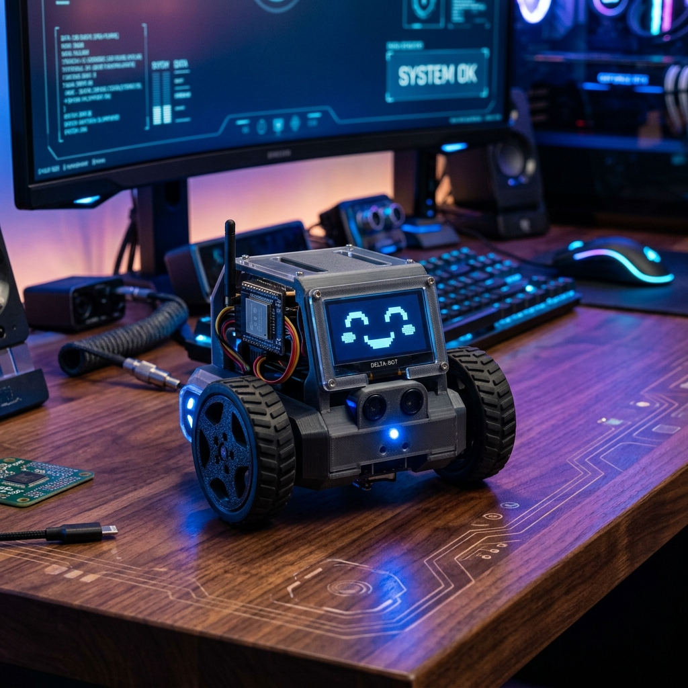
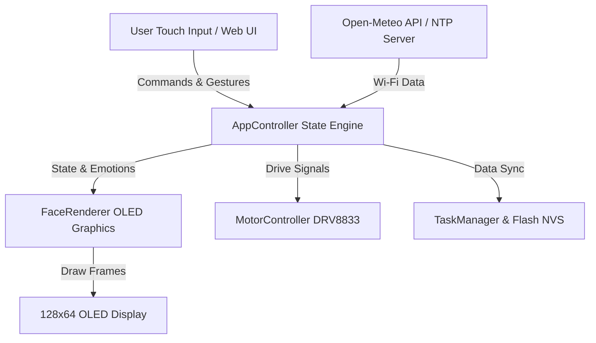

# 🤖 Delta-Bot (Deskbot) - Ultimate AI Companion & RC Robot

<div align="center">



[](https://platformio.org/)
[](https://www.espressif.com/)
[](https://www.arduino.cc/)
[](https://isocpp.org/)
[](LICENSE)

*An intelligent, expressive desktop companion robot powered by ESP32-C3 with real-time OLED face animations, RC drive mode, Web Speech AI voice control, virtual pet Tamagotchi features, Pomodoro study timers, live pixel art canvas, and flash persistence.*

[Features](#-feature-suite) • [Circuit Diagram](#-circuit-diagram--schematic) • [Architecture](#-system-architecture) • [Getting Started](#-getting-started) • [Web Control](#-web-control-dashboard)

</div>

---

## 🌟 Feature Suite

| Feature | Description |
| :--- | :--- |
| 🏎️ **RC Car Drive Mode** | Remote control driving via Web D-Pad with speed control & steering eyes animation |
| 🎭 **Smart Emotion Engine** | 8+ interactive animated face expressions (Happy, Love, Excited, Cool, Sad, Angry, Surprised, Sleep) |
| 🎙️ **Web Speech AI Voice Control** | Voice commands directly from your smartphone browser (*"Forward"*, *"Happy"*, *"Sleep"*, *"Weather"*) |
| 🐶 **Virtual Pet (Tamagotchi Mode)**| Hunger 🍕 & Happiness ❤️ meters with web feeding and touch head petting |
| 🎲 **Magic 8-Ball Decision Maker** | Ask YES/NO questions and receive animated answers with motor wheel shakes |
| ⏰ **NTP Clock & Live Weather** | Real-time clock synchronization and background weather updates (Open-Meteo API) |
| 📋 **Task Show & Notice Board** | Add To-Do lists via Web UI with checkbox indicators (`[x]`) and marquee announcements |
| ⏱️ **Pomodoro Productivity Timer** | 25-minute work focus + 5-minute coffee break timer with animated progress rings |
| 🎨 **Live Pixel Art Canvas** | Draw on mobile screen and render drawings instantly on Delta-Bot's OLED face |
| 🕵️‍♂️ **Desk Guard Security Mode** | Motion/touch intruder detection triggering `! BUSTED !` alarm face and warning motor pulses |
| 🌙 **Smart Night Light Mode** | Automatic ambient night mode with glowing moon & star animations after 10 PM |
| 💾 **Flash Persistence (NVS)** | Saved tasks, pet levels, and network settings preserved in ESP32 Flash across reboots |

---

## ⚡ Circuit Diagram & Schematic

### Hardware Pin Mapping

```text
               +----------------------------------+
               |        ESP32-C3 DevKitM-1        |
               +----------------------------------+
               | GPIO 8  (SDA)   ---> OLED SDA    |
               | GPIO 9  (SCL)   ---> OLED SCL    |
               | GPIO 4  (TOUCH) ---> TTP223 SIG  |
               | GPIO 3  (PWM_L) ---> DRV8833 PWMA|
               | GPIO 5  (IN1_L) ---> DRV8833 AIN1|
               | GPIO 6  (IN2_L) ---> DRV8833 AIN2|
               | GPIO 0  (PWM_R) ---> DRV8833 PWMB|
               | GPIO 7  (IN1_R) ---> DRV8833 BIN1|
               | GPIO 10 (IN2_R) ---> DRV8833 BIN2|
               | GPIO 1  (STBY)  ---> DRV8833 STBY|
               | 3V3 / GND       ---> VCC / GND   |
               +----------------------------------+
```

### Full Component Wiring Table

```text
┌──────────────────────┐        I2C Bus        ┌────────────────────────┐
│  OLED Display 128x64 │ <====================> │ ESP32-C3 Microcontroller│
└──────────────────────┘  SDA: GPIO 8, SCL: 9  └────────────────────────┘
                                                           │
                                                           │ PWM / Motor Direction
                                                           ▼
┌──────────────────────┐    Dual DC Motors     ┌────────────────────────┐
│   Left & Right Wheels│ <==================== │ DRV8833 Motor Driver   │
└──────────────────────┘                       └────────────────────────┘
                                                           ▲
                                                           │ Capacitive Signal
                                                       GPIO 4
                                                           │
                                               ┌────────────────────────┐
                                               │ TTP223 Touch Sensor    │
                                               └────────────────────────┘
```

---

## 🏗️ System Architecture



---

## 🛠️ Hardware Requirements & BOM

| Component | Quantity | Specification / Details | Pin Connection |
| :--- | :---: | :--- | :--- |
| **ESP32-C3 DevKitM-1** | 1 | 320KB RAM, 4MB Flash, Wi-Fi & BLE | Core Board |
| **OLED Display (I2C)** | 1 | 128x64 SSD1305 / SSD1306 | SDA: `GPIO 8`, SCL: `GPIO 9` |
| **Touch Sensor Module** | 1 | TTP223 Capacitive Touch | `GPIO 4` |
| **Motor Driver Module** | 1 | DRV8833 / TB6612 Dual H-Bridge | PWM L: `3`, IN1 L: `5`, IN2 L: `6`<br>PWM R: `0`, IN1 R: `7`, IN2 R: `10`<br>STBY: `GPIO 1` |
| **DC Gear Motors** | 2 | N20 Micro Gear Motors (6V) | Motor Outputs |
| **LiPo Battery & Charger**| 1 | 3.7V 1000mAh Battery + TP4056 | Power Bus |

---

## 🖨️ 3D Printable Enclosure (CAD Models)

Delta-Bot includes open-source 3D printable STL files located in [hardware/3d_models](hardware/3d_models):

- 📦 [`delta_bot_chassis.stl`](hardware/3d_models/delta_bot_chassis.stl): Main lower body chassis
- 🖥️ [`delta_bot_head_cover.stl`](hardware/3d_models/delta_bot_head_cover.stl): OLED & Touch panel head cover
- 🛞 [`delta_bot_wheel_left.stl`](hardware/3d_models/delta_bot_wheel_left.stl) & [`delta_bot_wheel_right.stl`](hardware/3d_models/delta_bot_wheel_right.stl): Drive wheels

> For 3D printing settings, infill recommendations, and assembly guides, see [hardware/3d_models/README.md](hardware/3d_models/README.md).

---

## 🚀 Getting Started

### 1. Prerequisites
- Install [VS Code](https://code.visualstudio.com/)
- Install the [PlatformIO IDE Extension](https://platformio.org/platformio-ide)

### 2. Clone Repository
```bash
git clone https://github.com/MehediEEE45/Delta-Bot.git
cd Delta-Bot
```

### 3. Configure Wi-Fi
Copy `include/Secrets.h.example` to `include/Secrets.h`:
```bash
cp include/Secrets.h.example include/Secrets.h
```
Edit `include/Secrets.h` with your local Wi-Fi credentials:
```cpp
#pragma once

namespace Config {
constexpr char WIFI_SSID[] = "YOUR_WIFI_NAME";
constexpr char WIFI_PASSWORD[] = "YOUR_WIFI_PASSWORD";
}
```

### 4. Build and Upload
1. Connect your ESP32-C3 board via USB.
2. Open PlatformIO in VS Code.
3. Click **Build** (`✓`) or **Upload** (`→`).
4. Open **Serial Monitor** at `115200` baud rate to check the IP address.

---

## 🌐 Web Control Dashboard

Access the built-in control dashboard from any smartphone or browser on your local network (or fallback AP `Delta` at `192.168.4.1`):

- 🏎️ **Drive D-Pad**: Touch controller for real-time RC driving.
- 🎙️ **Voice Control**: Web Microphone speech recognition.
- 🐶 **Virtual Pet**: Feed pizza and pet Delta-Bot's head.
- 🎨 **Live Canvas**: Draw pixels on your phone and render on OLED.
- 📋 **Task & Notice Manager**: Send announcements & manage To-Do lists.

---

## 🤝 Contributing

Contributions, feature requests, and bug reports are welcome! Feel free to check out the [Issues](https://github.com/MehediEEE45/Delta-Bot/issues) page.

---

## 📄 License

Distributed under the **MIT License**. See `LICENSE` for details.
