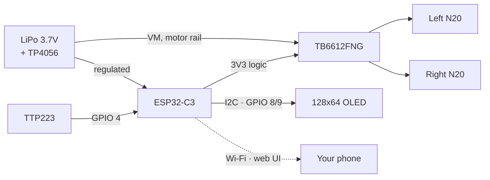
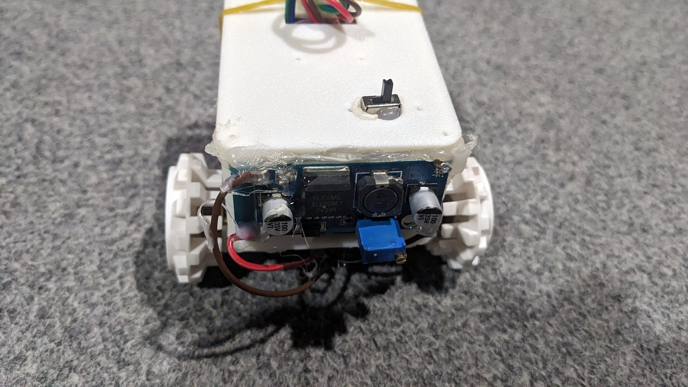
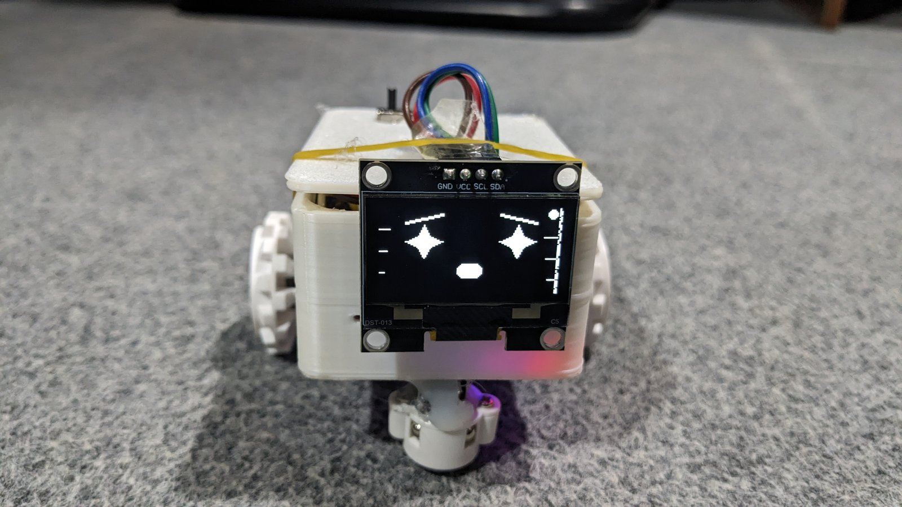
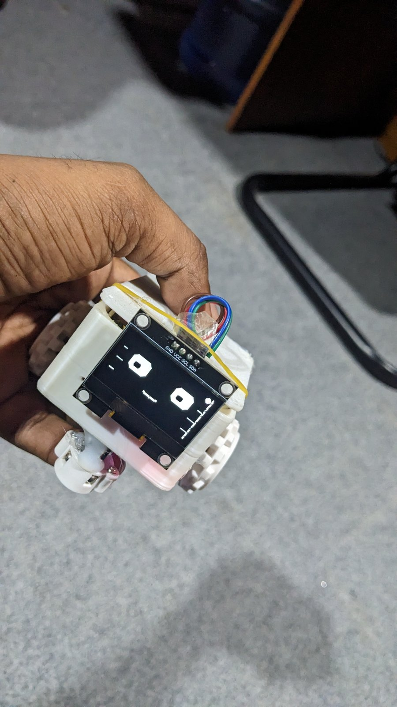

# Delta-Bot

A small desk robot built on an ESP32-C3. It shows a face on a 128×64 OLED,
reacts when you tap it, drives around from a web page on your phone, and keeps
a to-do list and a Pomodoro timer that you can see without picking up anything.

I built it because I wanted something on my desk that felt like it was *there* —
not another blinking status LED. Most of the work went into the face.


> **That image is a concept render, not a photo of the build.** I made it early
> on to figure out the proportions. The real bot has two wheels, no ultrasonic
> sensors, no antenna and no headlights — see the parts list below for what
> actually goes in it. Real photos are coming; the slots are further down.

[](https://www.espressif.com/)
[](https://platformio.org/)
[](LICENSE)

---

## What it does

| | |
| :--- | :--- |
| **Animated face** | Nine expressions on the OLED, each with its own eye shape, brow angle and mouth. Blinks at random intervals, drifts slightly when idle, and glances around on its own. |
| **Touch** | One capacitive pad. Single, double and triple taps each do something different; hold it to put the bot to sleep. |
| **RC driving** | A D-pad on the web page drives the two motors. The eyes lean into the turn. Motors cut out after one second if the browser stops sending, so a dropped connection can't run it off the desk. |
| **Voice** | The web page uses the browser's own speech recognition — say "forward", "left", "happy". No cloud service, no API key; it only works in Chrome-family browsers. |
| **Clock and weather** | NTP time, plus current conditions from Open-Meteo with drawn icons for sun, cloud, rain, snow and storms. |
| **To-do list** | Up to five tasks, added from the web page, ticked off from either end. Survives a reboot. |
| **Pomodoro** | 25 on, 5 off, with a ring that sweeps around the display as the interval burns down. Pauses and resumes properly. |
| **Virtual pet** | Hunger and happiness meters that decay slowly. Feed it from the web page or pat the touch sensor. |
| **Pixel canvas** | A 16×16 grid on your phone draws straight onto the OLED. |
| **Desk guard** | Arm it, and anyone who touches the bot gets a flashing alarm face and a wheel twitch. |
| **Night mode** | Switches to a moon-and-stars screen after 22:00 and puts your mode back at 06:00. |

Everything is served from the bot itself. There's no app and nothing phones home;
the only outbound request is the weather fetch.

---

## Hardware

### Parts list

| Part | Qty | Notes |
| :--- | :---: | :--- |
| ESP32-C3 SuperMini | 1 | Any ESP32-C3 board works. Build targets `esp32-c3-devkitm-1`, which is the standard stand-in — PlatformIO has no SuperMini definition. |
| 128×64 OLED, I²C | 1 | SSD1306 or SSD1305, 0.96". Get the one with the header on the **long** edge if you're printing the lid. |
| TB6612FNG motor driver | 1 | **Not a DRV8833.** See the warning below. |
| N20 gear motors, 6 V | 2 | 100–200 RPM is about right. Faster than that and it skitters. |
| TTP223 touch module | 1 | The cheap 3-pin one. |
| LiPo 3.7 V, ~1000 mAh | 1 | Plus a TP4056 charger board — get the variant **with** DW01 protection. |
| Wheels, 34 mm | 2 | For a 3 mm D-shaft. |

> ### The motor driver is not interchangeable
>
> The firmware drives **one PWM pin plus two direction pins per channel**
> (`PWMA` / `AIN1` / `AIN2`, plus `STBY`). That's the TB6612FNG interface.
>
> A **DRV8833 will not work with this wiring.** It has no `PWMA`/`PWMB` pins at
> all — you PWM the direction pins directly — and its enable is `nSLEEP`, not
> `STBY`. Wire a DRV8833 to this pinout and the motors will only ever run flat
> out. If a DRV8833 is what you have, tie `GPIO 1` to `nSLEEP` and rework
> `MotorController::setMotor()` to PWM the direction pins instead.

### Pinout

| Signal | GPIO | Goes to |
| :--- | :---: | :--- |
| I²C SDA | 8 | OLED SDA |
| I²C SCL | 9 | OLED SCL |
| Touch | 4 | TTP223 SIG |
| Left PWM | 3 | TB6612 PWMA |
| Left dir 1 | 5 | TB6612 AIN1 |
| Left dir 2 | 6 | TB6612 AIN2 |
| Right PWM | 0 | TB6612 PWMB |
| Right dir 1 | 7 | TB6612 BIN1 |
| Right dir 2 | 10 | TB6612 BIN2 |
| Standby | 1 | TB6612 STBY |

All of these live in [`include/Config.h`](include/Config.h) — the C3's GPIO
matrix means you can move any of them without touching another file.

### Wiring

```text
                     ┌──────────────────┐
     USB 5V ────────▶│  TP4056 + DW01   │
                     │   charge board   │
                     └───┬──────────┬───┘
                    BAT+ │          │ OUT+
                  ┌──────┴────┐     │
                  │ LiPo 3.7V │     │  3.2 - 4.2 V rail
                  └───────────┘     │
                                    ├──────────────────┐
                                    ▼                  ▼
                        ┌───────────────────┐   ┌─────────────┐
                        │  TB6612FNG   VM   │   │  ESP32-C3   │
                        │              VCC ◀├───┤ 3V3     5V  │
                        │              GND  │   │             │
                        │                   │   │             │
                        │  PWMA ◀───────────┼───┤ GPIO 3      │
                        │  AIN1 ◀───────────┼───┤ GPIO 5      │
                        │  AIN2 ◀───────────┼───┤ GPIO 6      │
                        │  PWMB ◀───────────┼───┤ GPIO 0      │
                        │  BIN1 ◀───────────┼───┤ GPIO 7      │
                        │  BIN2 ◀───────────┼───┤ GPIO 10     │
                        │  STBY ◀───────────┼───┤ GPIO 1      │
                        │                   │   │             │
                        │  AO1 AO2 BO1 BO2  │   │ GPIO 8 ─────┼──▶ OLED SDA
                        └───┬───┬───┬───┬───┘   │ GPIO 9 ─────┼──▶ OLED SCL
                            │   │   │   │       │             │
                          ┌─┴───┴─┐┌┴───┴─┐     │ GPIO 4 ◀────┼─── TTP223 SIG
                          │ N20 L ││ N20 R│     └─────────────┘
                          └───────┘└──────┘
                                              OLED + TTP223 VCC ── 3V3
                                              everything GND ───── common
```



### Three things that will bite you

**Power the motors from the battery, not the 3V3 pin.** `VM` on the TB6612 goes
to the LiPo rail; `VCC` is the logic supply and goes to 3V3. Every ground must be
common. Two N20s stalling will pull well over an amp, which no dev-board
regulator will survive.

**Feeding the ESP32 is the part worth thinking about.** A 3.7 V cell is below
what most 5 V pins want and above what's safe to inject straight into 3V3 at full
charge (4.2 V). A small boost converter to 5 V is the boring, correct answer.
Going LiPo-direct into 3V3 works right up until it doesn't.

**GPIO 8 and 9 are strapping pins.** That's the Arduino I²C default and normally
fine, but on a SuperMini board GPIO 8 usually also drives the onboard LED and
GPIO 9 is the BOOT button. If the bot sometimes refuses to start, this is the
first place to look: check for pull-ups on SDA/SCL and keep the leads short.

---

## Photos

I haven't shot the finished build yet, so rather than leave broken image links
in the README, here's the shot list. Drop each file into `docs/images/` with the
name given, then uncomment the matching line in the HTML block below and the
gallery appears.

| File to add | Shot | Why it matters |
| :--- | :--- | :--- |
| `build-wiring.jpg` | Everything laid out flat and connected, before it goes in the shell | The single most useful photo in any hardware repo — people copy wiring from photos, not diagrams |
| `face-closeup.jpg` | The OLED filling the frame, shot slightly off-axis so the glass doesn't blow out | This is the project. Lead with it once you have it |
| `assembled-side.jpg` | Side profile on a desk, something familiar next to it for scale | Answers "how big is it" instantly |
| `web-ui.png` | Phone screenshot of the dashboard | Easiest one to capture — no staging needed |

<!-- Uncomment each line as you add the file:




-->

---

## Printed parts

Four parts in [`hardware/3d_models/`](hardware/3d_models): body, lid, a motor
bracket (print two), and a clamp that holds the touch sensor against the lid.
PLA, 0.2 mm, 20% infill, supports only on the body.

Print settings, tolerances and the assembly order are in
[`hardware/3d_models/README.md`](hardware/3d_models/README.md). The short version:
mount the motors before anything else goes in, or you won't reach the screws.

---

## Getting it running

You'll need [VS Code](https://code.visualstudio.com/) and the
[PlatformIO extension](https://platformio.org/platformio-ide).

```bash
git clone https://github.com/MehediEEE45/Delta-Bot.git
cd Delta-Bot
cp include/Secrets.h.example include/Secrets.h
```

Then fill in `include/Secrets.h`. It's gitignored, so nothing here gets committed:

```cpp
namespace Config {
constexpr char WIFI_SSID[]     = "YOUR_WIFI_SSID";
constexpr char WIFI_PASSWORD[] = "YOUR_WIFI_PASSWORD";

// Password for the fallback access point the bot starts when it can't
// join your network. Needs 8+ characters or it falls back to an open AP.
constexpr char FALLBACK_AP_PASSWORD[] = "CHANGE_ME_AP";

// Login for the web dashboard. Every endpoint that changes something is
// behind this. Leave the password empty to turn auth off — but then anyone
// on your network can drive the motors and rewrite your Wi-Fi settings.
constexpr char WEB_USER[]     = "delta";
constexpr char WEB_PASSWORD[] = "CHANGE_ME_WEB";
}
```

Plug the board in, hit Upload, then open the serial monitor at 115200 to find
the IP address. Open that in a browser and you're in.

If it can't reach your network it starts its own, called **Delta**. Join that and
go to `192.168.4.1` to set the real credentials.

---

## The web dashboard

Served straight off the board — one page, no build step, no dependencies.

- Drive pad with a speed slider
- Every emotion and mode as a button
- Task list with add, tick and delete
- Pomodoro, reminders, notices, the 8-ball, the pet
- Pixel canvas that draws on the OLED as you tap
- Wi-Fi setup

Status polls every two seconds. If a request fails, the page tells you what
happened instead of silently doing nothing.

---

## How the code is laid out

```
src/
  main.cpp           Wi-Fi bring-up, the loop
  AppController      Mode and emotion state machine
  FaceAnimator       Expression morphing, blinking, gaze — no display calls
  FaceRenderer       Everything that draws to the OLED
  TaskManager        Tasks, pet, pomodoro, reminders, canvas
  MotorController    TB6612 driver, watchdog, non-blocking wiggle
  WebController      HTTP server and the dashboard page
  Weather            Open-Meteo fetch, on its own FreeRTOS task
```

Two decisions worth explaining.

**The weather fetch runs on its own task.** A TLS handshake on a C3 takes a few
seconds, and doing that inside `loop()` froze the display and the web server
solid. The C3 is single-core, so the worker and the main loop take turns rather
than running in parallel, but the face keeps animating through it.

**`FaceAnimator` never touches the display.** It works out where everything
should be and hands over a struct; `FaceRenderer` draws it. That split means the
animation maths can be tested on a laptop with fake timestamps, and it keeps the
drawing code from accumulating state.

There's a preview script at [`tools/preview_face.py`](tools/preview_face.py) that
renders the expressions as ASCII, so you can check the geometry without flashing
anything. It caught three real layout bugs before they ever hit hardware.

---

## Rough edges

Things I know about, listed here rather than discovered by you:

- Tasks are capped at five. It's a fixed array.
- No OTA yet, so updates mean plugging in a cable. The board is at 80% of its
  flash slot, which is the thing standing in the way.
- The battery gauge is wired in software but there's no divider on the board, so
  the API honestly reports `batteryMeasured: false` instead of inventing a number.
- No tests and no CI. Next on the list — the touch gesture logic and the Pomodoro
  maths are both pure functions and should be tested on a laptop.
- The face was tuned against an ASCII preview, not a real panel. Some of the
  geometry will want nudging once I've stared at it for a week.

---

## License

MIT. Do what you like with it.
